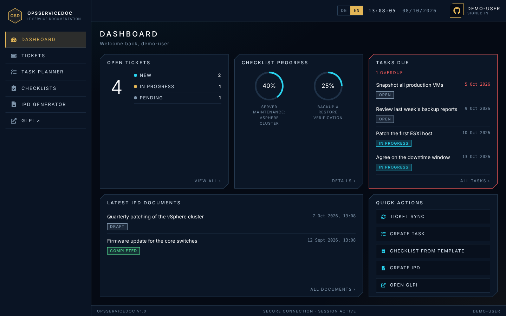
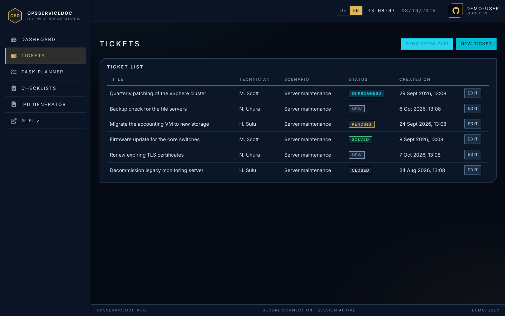
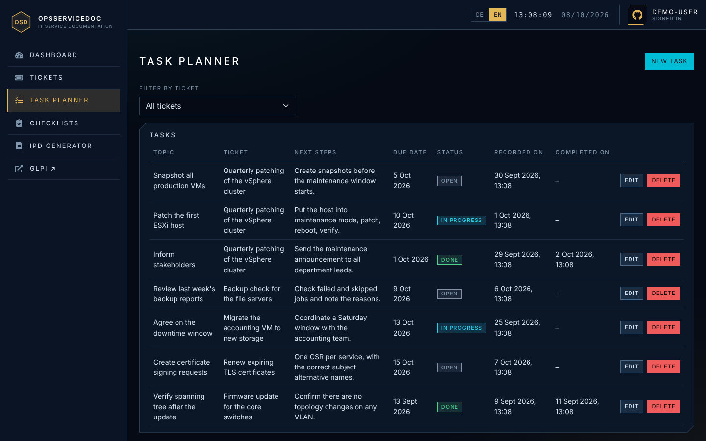
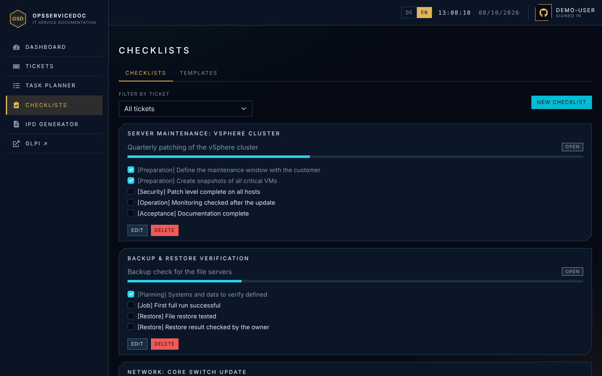
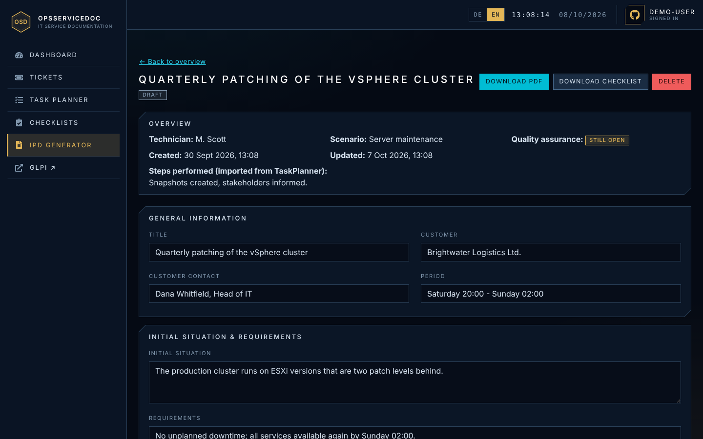
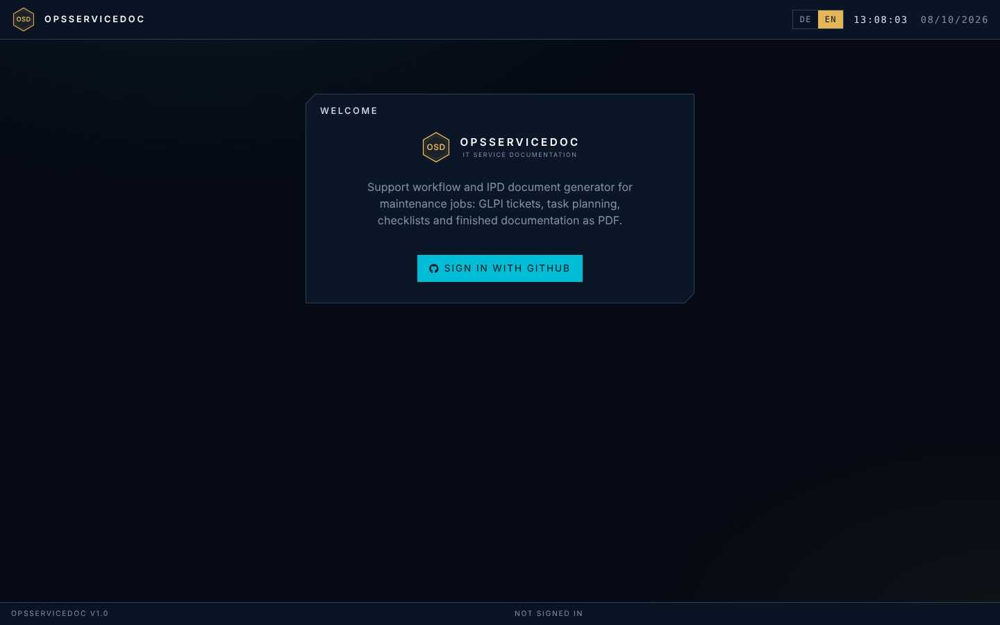
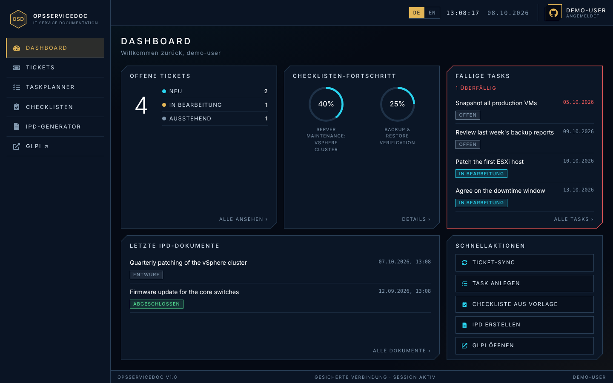

# OpsServiceDoc

Support workflow and IPD document generator for IT maintenance jobs. The application follows a job from start to finish: tickets come from **GLPI**, the individual work steps are tracked in the **task planner**, internal quality assurance runs through **checklists**, and the result is a finished **IPD document** (Infrastructure Planning & Design) as a PDF for the customer.

The project was built as a capstone project during a Java bootcamp. The user interface is available in **English and German** (language switcher in the top bar).



## Features

| Area | What it does |
| --- | --- |
| **Dashboard** | Open tickets, checklist progress, due and overdue tasks, latest IPD documents, quick actions. |
| **Tickets** | Synchronise tickets from GLPI, view and edit them (status, technician, scenario). |
| **Task planner** | Record next steps per ticket with due dates and status. |
| **Checklists** | Create checklists from reusable templates and tick off items. Download a printable PDF for the technician. |
| **IPD generator** | Create an IPD draft from a ticket. Performed steps and the quality-assurance status are derived from the ticket's tasks and checklists. Download the customer PDF. |
| **GLPI link** | Navigation and dashboard link straight to the GLPI web interface. |

| Tickets | Task planner |
| --- | --- |
|  |  |

| Checklists | IPD document |
| --- | --- |
|  |  |

| Sign-in | German UI |
| --- | --- |
|  |  |

The screenshots show invented demo data only.

## Tech stack

**Backend** (`backend/`)
- Java 25, Spring Boot 4.1
- Spring Web MVC, Spring Security (GitHub OAuth2 login), Bean Validation
- Spring Data MongoDB
- OpenPDF for PDF generation
- springdoc-openapi (Swagger UI)
- JUnit 5, Mockito, MockMvc, JaCoCo

**Frontend** (`frontend/`)
- React 19, TypeScript, Vite
- React Router, React-Bootstrap
- react-i18next (English and German)

**Infrastructure**
- MongoDB 7, GLPI and its MySQL database via Docker Compose
- GitHub Actions: build, test and lint for backend and frontend

## Prerequisites

- JDK 25
- Node.js 20 or newer
- Docker with Docker Compose
- A GitHub account (for the OAuth app used to sign in)

## Run locally

### 1. Create the environment file

Copy `.env.example` to `.env` in the project root and fill in the values. The file is listed in `.gitignore` and is never committed. See [Configuration](#configuration) for all variables.

### 2. Start the databases and GLPI

```bash
docker compose up -d
```

This starts MongoDB (port 27017), GLPI (port 80) and the GLPI database.

GLPI must be set up through its web installer at `http://localhost` on first start. Afterwards, enable the REST API in GLPI and create an app token and a user token. Both go into `.env`.

### 3. Create a GitHub OAuth app

In GitHub, go to Settings, Developer settings, OAuth Apps and create a new app:

- Homepage URL: `http://localhost:5173`
- Authorization callback URL: `http://localhost:8080/login/oauth2/code/github`

Put the client ID and client secret into `.env`.

### 4. Start the backend

The backend reads its configuration from environment variables, so load `.env` first (or set the variables in your IDE run configuration), then:

```bash
cd backend
./mvnw spring-boot:run
```

The backend runs on `http://localhost:8080`. The API documentation is available at `http://localhost:8080/swagger-ui.html`.

To start with invented demo data (tickets, tasks, checklists and IPD documents) on an empty database, activate the `demo` profile:

```bash
SPRING_PROFILES_ACTIVE=demo ./mvnw spring-boot:run
```

The seeder only runs when the ticket collection is empty.

### 5. Start the frontend

```bash
cd frontend
npm ci
npm run dev
```

The frontend runs on `http://localhost:5173` and proxies `/api` to the backend.

On Windows, `scripts/start.bat` starts everything in one go and `scripts/stop.bat` stops it again.

## Configuration

| Variable | Required | Purpose |
| --- | --- | --- |
| `GITHUB_CLIENT_ID`, `GITHUB_CLIENT_SECRET` | yes | GitHub OAuth app used for sign-in |
| `GLPI_API_URL` | yes | GLPI REST API, e.g. `http://localhost/api.php/v1` |
| `GLPI_APP_TOKEN` | yes | GLPI API app token |
| `GLPI_USER_TOKEN` | yes | GLPI API user token |
| `GLPI_WEB_URL` | no | Address of the GLPI web interface for the link in the frontend. Default: `http://localhost` |
| `FRONTEND_URL` | no | Where the browser is sent after login and logout. Default: `http://localhost:5173` |
| `MONGODB_URI` | no | MongoDB connection string. Default: the local Docker Compose instance |
| `GLPI_DB_HOST`, `GLPI_DB_NAME`, `GLPI_DB_USER`, `GLPI_DB_PASSWORD`, `GLPI_DB_PORT` | for Docker Compose | Access to the GLPI database |

The `admin`/`admin` MongoDB credentials in `docker-compose.yml` are for local development only.

## Tests and quality

```bash
cd backend
./mvnw test

cd ../frontend
npm run lint
npm run build
```

The backend tests need a running MongoDB (see `docker compose`). The GitHub Actions workflows in `.github/workflows/` run the same steps on every pull request.

## API overview

All endpoints live under `/api` and require a login. The complete, interactive documentation is in the Swagger UI.

| Path | Purpose |
| --- | --- |
| `GET /api/auth/me` | Current GitHub user |
| `/api/tickets` | Manage tickets; `POST /api/tickets/sync-glpi` synchronises from GLPI |
| `/api/tasks` | Tasks per ticket |
| `/api/checklists` | Checklists; `POST /api/checklists/from-template` creates one from a template |
| `/api/checklist-templates` | Checklist templates |
| `/api/ipd` | IPD documents; `POST /api/ipd/from-ticket/{ticketId}` creates a draft |
| `GET /api/ipd/{id}/pdf` | Customer PDF |
| `GET /api/ipd/{id}/checklist-pdf` | Checklist PDF for the technician |
| `GET /api/config/glpi-url` | Address of the GLPI web interface |

## Security

- **Login:** OAuth2 with GitHub, followed by a session cookie.
- **Access control:** `/api/**` is protected as a whole, so new controllers are secured automatically. Without a login the API answers with `401`.
- **CSRF protection:** Write requests need a CSRF token. The backend sets it as the `XSRF-TOKEN` cookie and the frontend sends it back in the `X-XSRF-TOKEN` header (see `frontend/src/api/api.ts`).
- **Secrets:** Tokens and passwords live only in environment variables or the untracked `.env` file.

## Project structure

```
ops-service-doc/
├── backend/                 Spring Boot application
│   └── src/main/java/org/dahllab/opsservicedoc/
│       ├── config/          GLPI configuration, seeders (built-in templates, demo data)
│       ├── controller/      REST endpoints
│       ├── dto/             API data objects
│       ├── exception/       Central error handling
│       ├── model/           MongoDB documents
│       ├── repository/      Spring Data repositories
│       ├── security/        Login and security configuration
│       ├── service/         Business logic, GLPI client
│       └── util/            Mappers and PDF generators
├── frontend/                React application
│   └── src/
│       ├── api/             Fetch helpers and types
│       ├── auth/            Login state
│       ├── components/      Reusable building blocks
│       ├── hooks/           Custom hooks
│       ├── i18n/, locales/  Translations (en, de)
│       ├── pages/           Pages (tickets, task planner, checklists, IPD)
│       └── utils/           Formatting and download helpers
├── docs/screenshots/        Images used in this README
├── scripts/                 Windows start and stop scripts
├── docker-compose.yml       MongoDB, GLPI, GLPI database
└── .github/workflows/       CI
```

## Notes

- The user interface is translated; texts that come from GLPI or are typed in by users are shown as entered.
- The generated PDFs are in English.

## Planned improvements

- Avoid duplicate tickets on repeated GLPI syncs
- Frontend tests for helpers and pages
- More tests for branches in the services
- More maintenance scenarios and checklist templates
